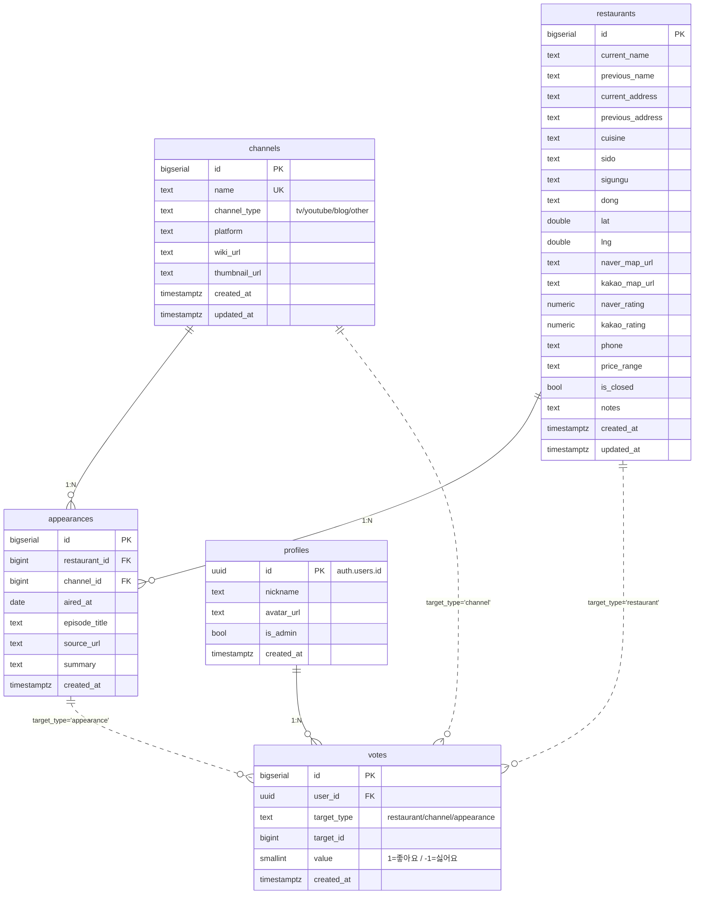

# 백안맛지도 — ERD

## 주요 제약
- `restaurants(current_name, current_address)` UNIQUE — 같은 가게 중복 수집 방지
- `votes(user_id, target_type, target_id)` UNIQUE — 아이디별 대상당 1회
- `votes.value` CHECK (1, -1) — 좋아요/싫어요 2진 투표

## 뷰
- `v_restaurant_score` — 맛집별 좋아요/싫어요/순점수
- `v_channel_score` — 채널별 좋아요/싫어요/순점수
- `v_top_representative_appearance` — 맛집의 "대표 방송 회차"(좋아요 최다 1개)
